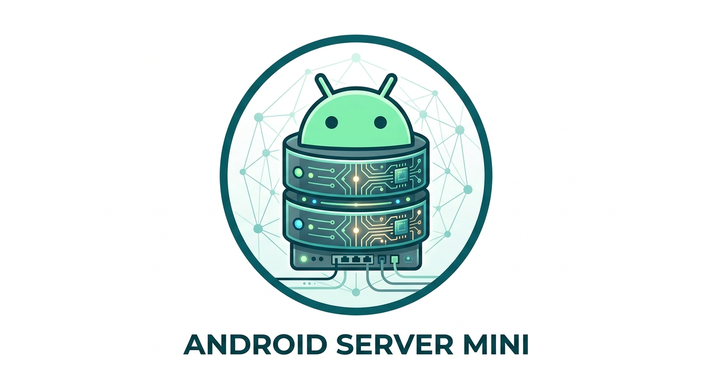
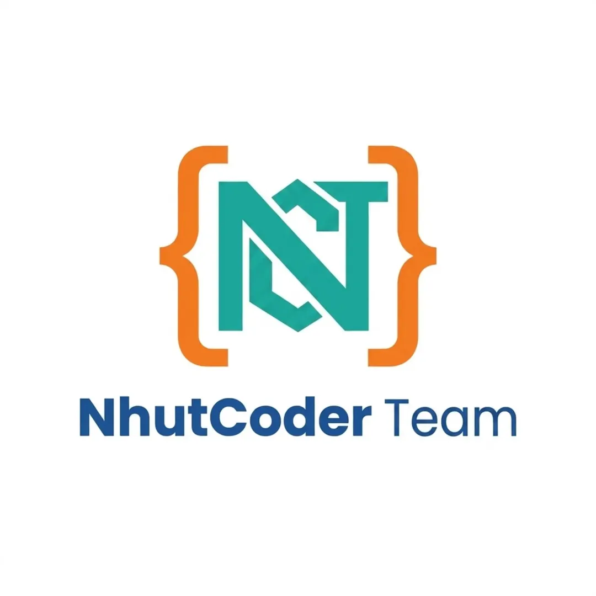

<p align="center">
  
  <span style="font-size: 3em; font-weight: bold; font-family: monospace; vertical-align: middle; display: inline-block; margin-left: 10px;">first-tree</span>
</p>

<p align="center">
  <a href="https://ais-pre-xvn665it2vwvvagwnibajv-94278657433.asia-east1.run.app">Open App</a> · 
  <a href="#giới-thiệu">Get Started</a> · 
  <a href="#tính-năng-nổi-bật">How It Works</a> · 
  <a href="#hướng-dẫn-cấu-hình">Quickstart</a> · 
  <a href="#quy-trình-đóng-gói--cập-nhật-phiên-bản-mới">Discussions</a>
</p>

<p align="center">
  
  
  
  
</p>

<p align="center">
  <a href="#">English</a> | <a href="#">Tiếng Việt</a>
</p>

<p align="center">
  Use this link to use <a href="https://ais-pre-xvn665it2vwvvagwnibajv-94278657433.asia-east1.run.app">first-tree 🌳</a> for free!!! — the most efficient way to loopmaxx your engineering work.
</p>

---

# First-Tree (Android Mini Server & AI Hub)
### Context-grounded agentic work for teams.

First Tree is an open-source workspace where AI agents work from your team's shared context, not isolated prompts. Turn your Android device into a 24/7 background-running server, equipped with a Python Executor & Sandboxed Pip environment, continuous Telegram/Discord bots, and local database persistence.

---

### 🎨 Trạng thái hoạt động (Status Badges)
<p align="left">
  
  
  
  
  
</p>

---

## 🚀 Tính năng nổi bật - Phiên bản v1.0.9

- **Dịch vụ chạy ngầm 24/7**: Sử dụng `PowerManager` WakeLock và tính năng khởi chạy lại thông minh tránh trùng lặp tài nguyên, duy trì dịch vụ ngay cả khi khóa màn hình.
- **Python Workspace & Terminal**:
  - Trình soạn thảo kịch bản Python trực tuyến tiện lợi.
  - Bộ thực thi Python nhị phân thật hoặc Sandbox giả lập (tự động chuyển đổi thông minh).
  - **Mới:** Nút/Khung cài đặt thư viện Python (**Pip**) trực quan ngay bên dưới terminal cùng danh sách gợi ý nhanh (`requests`, `beautifulsoup4`, `pytelegrambotapi`, `discord.py`, `aiohttp`, `urllib3`).
- **AI Hub - Trí tuệ nhân vật**: Tích hợp sẵn bộ REST API hỗ trợ streaming và tracking token cho Gemini, OpenAI, Anthropic, DeepSeek.
- **Auto Update liền mạch qua GitHub**: Tải về và cài đặt trực tiếp file `.apk` đã được ký tự động bằng Keystore bảo mật.

---

## 🔧 Hướng dẫn cấu hình

### Khởi chạy Server
1. Cấu hình Cổng (Port) mong muốn (Ví dụ: `8080`).
2. Bật Toggle khởi động máy chủ. Máy chủ sẽ bắt đầu phân phát trên địa chỉ IP Wifi hiện tại của bạn.

### Sử dụng Python Pip Installer
1. Truy cập tab **Python Notepad**.
2. Cuộn xuống phần **Cài đặt thư viện Python (Pip)**.
3. Nhập tên gói bất kỳ (ví dụ: `requests`) hoặc nhấp chọn một trong các gợi ý cài nhanh để hệ thống tự động tải và tích hợp vào môi trường làm việc của bạn.

---

## 📦 Quy trình đóng gói & Cập nhật phiên bản mới

Ứng dụng sử dụng GitHub Actions tự động hóa:
1. Thêm tag mới (ví dụ: `v1.0.9`):
   ```bash
   git tag v1.0.9
   git push origin v1.0.9
   ```
2. Workflow sẽ tự động giải mã debug Keystore bảo mật, biên dịch phiên bản đã ký và phát hành trực tiếp lên GitHub Releases.

---

<p align="center">
  <br/>
  <b>Powered By Nhutcoder Team</b>
  <br/>
  <br/>
  
</p>
